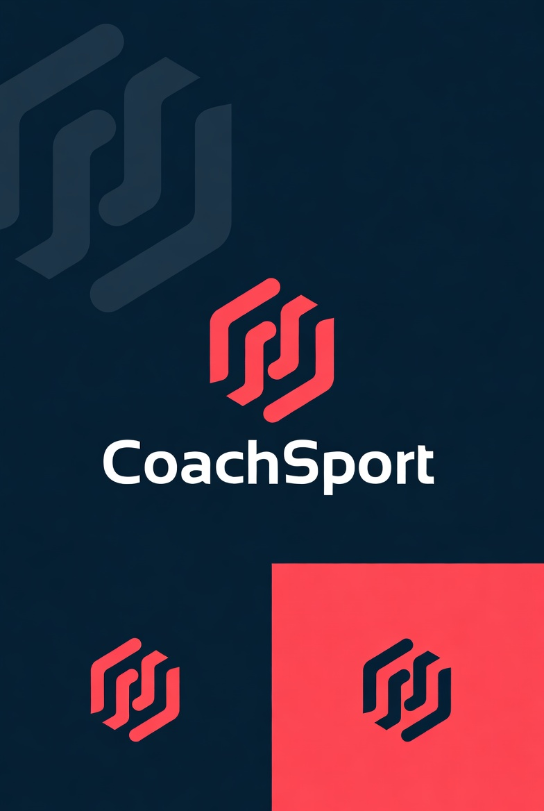
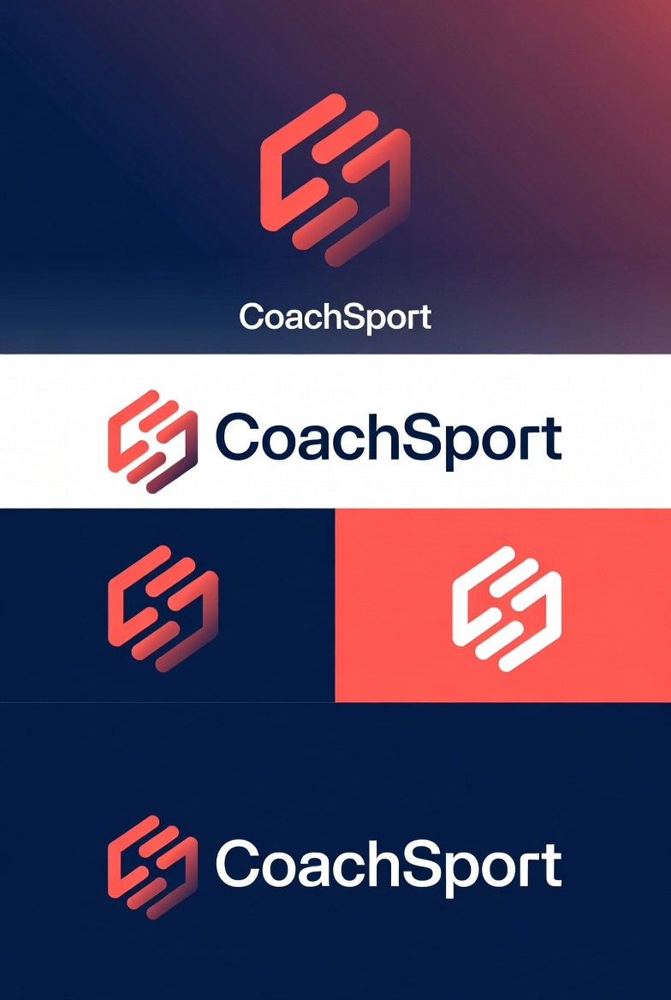

# CoachSport

## Marca

### Identidad visual de CoachSport

CoachSport representa la simplicidad y accesibilidad de la calistenia, inspirándose en las barras paralelas y en formas geométricas básicas. La estética combina azules profundos, grises neutros y un acento en rojo energético, creando una identidad moderna y minimalista. La tipografía sans‑serif aporta una presencia sólida en títulos y una lectura limpia en textos.

## 🎨 Paleta de colores

| Color                            | Muestra                                                                                                    | HEX       | Uso recomendado                                       |
| -------------------------------- | ---------------------------------------------------------------------------------------------------------- | --------- | ----------------------------------------------------- |
| Primario: Azul petróleo profundo | <div style="width:20px; height:20px; background:#002B36; border-radius:4px;"></div>                        | `#002B36` | Elementos principales, fondos oscuros, identidad base |
| Secundario: Rojo energía         | <div style="width:20px; height:20px; background:#FF3B30; border-radius:4px;"></div>                        | `#FF3B30` | Acentos fuertes, alertas, elementos destacados        |
| Neutral oscuro: Gris grafito     | <div style="width:20px; height:20px; background:#2E2E2E; border-radius:4px;"></div>                        | `#2E2E2E` | Texto sobre fondos claros, UI secundaria              |
| Neutral claro: Gris titanio      | <div style="width:20px; height:20px; background:#A7B0B5; border-radius:4px; border:1px solid #ccc;"></div> | `#A7B0B5` | Fondos suaves, separadores, tarjetas                  |
| Acento positivo: Verde progreso  | <div style="width:20px; height:20px; background:#4CAF50; border-radius:4px;"></div>                        | `#4CAF50` | Indicadores de éxito, progreso, confirmaciones        |

> La paleta busca transmitir claridad, fuerza y enfoque, manteniendo la estética minimalista de CoachSport.

### De Grok Imagine al concepto final

El proceso creativo comenzó generando ideas con Grok Images, explorando líneas rectas, figuras simples y composiciones que transmiten equilibrio y control. Estas primeras visuales ayudaron a definir un lenguaje claro y accesible, alineado con la filosofía de entrenar sin vueltas y con ejercicios que cualquiera puede hacer.

<div style="display: flex; gap: 20px">


</div>

### Diseño final en Inkscape

Las ideas iniciales se refinaron en Inkscape, donde se definieron proporciones, retículas y la paleta cromática final. El resultado es una marca versátil y escalable, construida con vectores limpios y colores planos, ideal para la UI/UX de la app y para materiales visuales en distintos tamaños.

| Versión       | Vista                                                                                  |
| ------------- | -------------------------------------------------------------------------------------- |
| **Isotipo**   |                  |
| **Logotipo**  |            |
| **Imagotipo** |  |

> Las formas geométricas simples y las barras paralelas representan la esencia de la calistenia: simplicidad, equilibrio y accesibilidad.

## Desarrollo

**Funcionalidades Principales**

- Auth: Registro, Login y Logout con Firebase.
- Roles: Niveles de acceso para Admin y Cliente.
- Membresías: Diferenciación entre Usuario Free y Premium (Pago).
- Entrenamiento, Biblioteca, Progreso, Gestión, Persistencia.

**Suscripciones**

- (Stripe / Mercado Pago)

**Deploy**

- Vercel

### Metodología: Vibe Coding & Refactor

El desarrollo se divide en dos fases:

- Fase Vibe (UI/UX): Generación masiva de componentes, layouts y flujos visuales utilizando prompts de IA. Objetivo: llegar al MVP visual en tiempo récord.

- Fase de Adaptación (Coding):
  - Tipado: Sustituir los any generados por interfaces de TypeScript reales.
  - Data Binding: Conectar los componentes "vibe-coded" con Firestore y Firebase Auth y eliminar todo lo de localStorage que se uso para un Mockup/Demo.
  - Lógica de Pagos: Implementar manualmente el flujo de Stripe/Mercado Pago y Webhooks en Vercel para asegurar la integridad de las transacciones.
  - Seguridad: Escribir las Firestore Rules para proteger los datos que la IA dejó abiertos por defecto(Vamos a implementar una estrategia de seguridad desde el cliente y desde el server). asegurando que las reglas de Firestore actúen como firewall y las Functions como validadoras de lógica.

### Blueprint

Este proyecto, además de ser CoachSport, es nuestro Blueprint personal. La idea es que todo el flujo que armemos aca nos sirva de template para no tener que configurar todo desde cero en el próximo proyecto. Aunque no somos expertos en Firebase, logramos dominar el flow de trabajo y arrancar con una base sólida.

## Proceso

### Para crear un proyecto nuevo en PNPM.

```bash
    pnpm create next-app@latest . --typescript
```

Para usar un gestor distinto a **pnpm**:

- **pnpm:** `pnpm create next-app@latest . --typescript`
- **npm:** `npx create-next-app@latest . --typescript`
- **yarn:** `yarn create next-app . --typescript`
- **bun:** `bun create next-app@latest . --typescript`

### Integrando dependencias.

Para instalar los paquetes necesarios:

```bash
# Con pnpm
pnpm install

# Con npm
npm install

# Con yarn
yarn install
```

### Correr proyecto.

| Acción         | pnpm         | npm             | yarn         |
| :------------- | :----------- | :-------------- | :----------- |
| **Desarrollo** | `pnpm dev`   | `npm run dev`   | `yarn dev`   |
| **Build**      | `pnpm build` | `npm run build` | `yarn build` |
| **Producción** | `pnpm start` | `npm run start` | `yarn start` |

### Stack

- React, TypeScript, TailwindCSS

### Auth y DB

Para el Auth y Base de datos vamos a utilizar Firebase y Firestore.

[GOOGLE FIREBASE](https://firebase.google.com/)

- Firebase y Firestore Database.

### Integrar Firebase

Implementamos Firebase en una fase exploratoria para medir su impacto en el flujo de desarrollo. Más allá de la instalación, buscamos identificar de primera mano sus fortalezas y debilidades asegurándonos de que la elección de esta tecnología sea una decisión técnica fundamentada y no solo una alternativa de conveniencia.

Desde la terminal del proyecto:

```bash
pnpm add firebase
```

Con esto ya podemos configurar el Auth utilizando lo que nos da la consola de Firebase.

Luego para reglas de validacion basicas en la base de datos vamos a usar **Rules** en Firestore, pero esto no va a ser suficiente ya que podemos validar lo minimo, vamos a necesitar **Cloud Functions** vamos a instalar el CLI.

Para esto lo implementamos de la siguiente manera desde la terminal:

```bash
pnpm add -g firebase-tools
```

**Notas**

Cuando intentamos implementar tuvimos un pequeño error con pnpm:

```bash
 ERR_PNPM_NO_GLOBAL_BIN_DIR  Unable to find the global bin directory
```

Para solucionarlo usamos:

```bash
pnpm setup
```

Luego cerramos e iniciamos terminal nuevamente para asegurar que tome las variables de entorno, y volvemos a ejecutar `pnpm add -g firebase-tools`

**Notas**

Si llegamos a tener un problema de sessiones cruzadas cuando queremos loguear desde el CLI, solucion `firebase login --no-localhost` para que nos de un link manual.

Seguimos el link, y en algun momento no pedira reauth `firebase login --reauth`

---

### Init Functions

```bash
firebase init functions
```

Asociamos nuestros proyectos; en este caso tenemos dos:

- El proyecto que va a estar en **Prod**, con su base de datos.
- El proyecto que va a estar en **Dev/Local**, con su base de datos.

Comenzamos integrándolo al entorno local. Luego deployamos las Functions en el proyecto de **Prod** una vez que lo tengamos listo y funcionando correctamente en **Local**.

---

### Blaze

Para poder probar toda la funcionalidad de Cloud Functions hay que suscribirse al plan **Blaze**.
Por ahora esto no es necesario, pero dejamos todo listo para una implementación futura.

---

### Vercel

Creamos una cuenta en Vercel y la conectamos al repositorio en GitHub.
La configuramos para usar dos ramas (_branches_): una de **dev** y otra llamada **master**.

Todos los cambios que hacemos en nuestro entorno local los pusheamos a **dev**. Estos son detectados automáticamente por Vercel y desplegados en el entorno de desarrollo.

Luego, de forma manual, hacemos un **PR** desde `dev` hacia `master`, lo que actualiza **PROD** cuando estamos seguros de que todo funciona correctamente en **Dev** y ha sido apropiadamente testeado.

---

### Notas

Pequeño error que encontramos: hemos usado Vercel anteriormente con **Next.js** sin problemas, pero con **React** aparece un pequeño error de DNS cuando hacemos _reload_ en la página y esta se pierde.

La solución es sencilla.

En el root del proyecto creamos un archivo llamado `vercel.json`:

```json
{
  "rewrites": [{ "source": "/(.*)", "destination": "/index.html" }]
}
```

### Roadmap

- [ ] Pulir UI y detalles visuales
- [ ] Mejorar filtros y UI de la biblioteca de ejercicios
- [ ] Simplificar los visualizadores de ejercicios
- [ ] Optimizar la carga y gestión de ejercicios desde el panel de admin
- [ ] Terminar de estructurar bien las rutinas
- [ ] Ordenar y normalizar los datos de usuario
- [ ] Armar formulario de contacto (público y usuarios logueados)
- [ ] Completar y estructurar correctamente la base de datos
- [ ] Implementar tests con Vitest
- [ ] Revisar seguridad (roles y reglas de Firestore)
- [ ] Implementar pasarela de pagos (Stripe / MercadoPago según país del usuario)
- [ ] Implementar aceptación obligatoria de Privacy Policy (bloquear acceso hasta que el usuario acepte desde el modal)
- [ ] Rediseñar la ventana de Progreso (calendario simple con días entrenados y gráfico de seguidilla)
